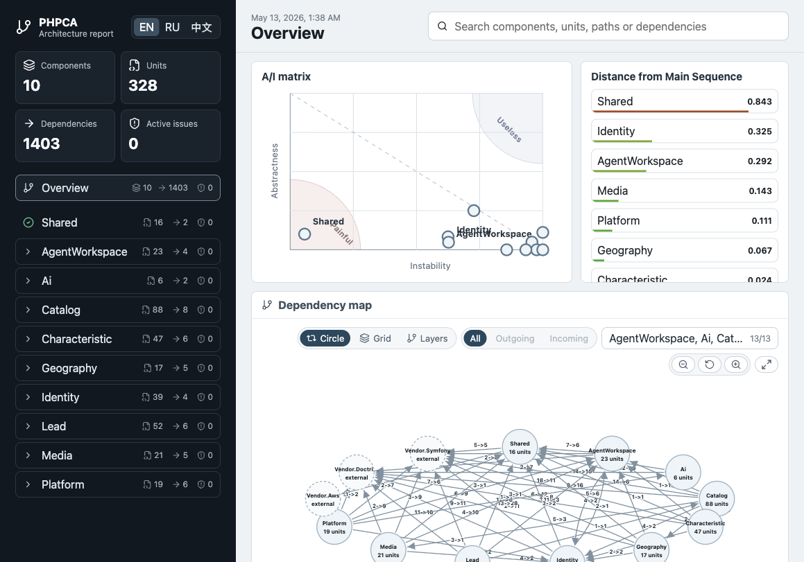
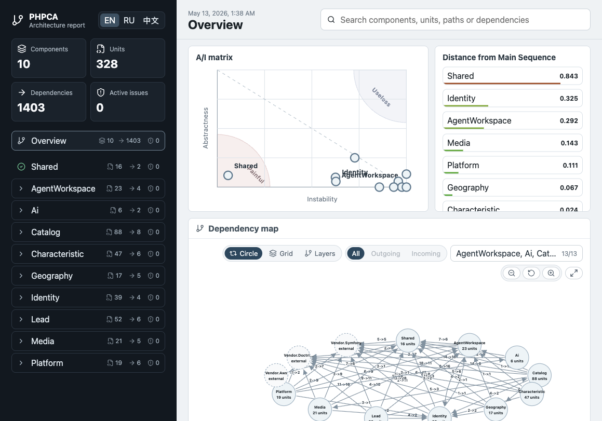
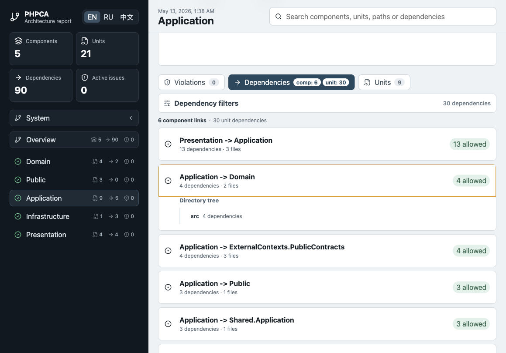

# PHP Clean Architecture

A tool for automating architecture quality control in PHP applications, as well as analyzing and visualizing
architecture metrics.

The idea was inspired by Robert C. Martin's "Clean Architecture".
If you have not read it yet, you can start with the key ideas behind this tool:
https://habr.com/en/post/504590/

## Quick Start

```shell script
composer require v.chetkov/php-clean-architecture --dev
cp vendor/v.chetkov/php-clean-architecture/example.phpca-config.php phpca-config.php
vendor/bin/phpca-check phpca-config.php
vendor/bin/phpca-build-reports phpca-config.php
```

## Compatibility

The package can be installed in projects running PHP 7.4 or newer.

The analyzer can still read PHP 8.5 syntax through AST. This means the analyzed project may use modern PHP syntax, while
the tool runtime remains compatible with older PHP versions starting from PHP 7.4.

## Configuration

Copy the sample config to the project root:

```shell script
cp vendor/v.chetkov/php-clean-architecture/example.phpca-config.php phpca-config.php
```

Configuration details are described in the sample config:
https://github.com/Chetkov/php-clean-architecture/blob/master/example.phpca-config.php

### Public And Private Component API

`public_elements` and `private_elements` describe the component API exposed to other components. They do not forbid using
an element inside its owning component.

For example, `ComponentA\Service` may depend on `ComponentA\Internal\Model`. This is an internal component dependency. It
may still be shown in the dependency graph as internal, but it is not a private API violation.

However, `ComponentB\Service` must not depend on `ComponentA\Internal\Model` when that element is outside
`ComponentA`'s public API or is explicitly listed in `private_elements`.

### Nested Reports

For large systems, a single global graph often becomes too noisy. In those cases the architecture can be described
recursively: the top level shows large system components, while each component can describe its layers, subcomponents, or
another decomposition level.

A top-level component may contain a `sub` config:

```php
'components' => [
    'AgentWorkspace' => [
        'roots' => [...],
        'sub' => require __DIR__ . '/phpca-configs/layers/AgentWorkspace.php',
    ],
],
```

The `sub` format is the same as a regular `phpca-config.php`. The same file can still be executed standalone, or required
from a parent config.

When running from a parent config:

- `phpca-check` checks the root config and all nested `sub` configs one by one;
- `phpca-build-reports` creates one SPA report where you can navigate between analysis levels;
- the child config's local `reports_dir` is ignored;
- the nested report path is built from the root `reports_dir` plus the component hierarchy path.

Inheritance is explicit:

```php
'inherit' => ['factories', 'vendor_based_components', 'exclusions'],
```

If `inherit` is omitted, the child config inherits nothing. `components` are never inherited.

This makes it possible to keep several useful architecture-control levels:

- whole system: dependencies between bounded contexts or large modules;
- component: dependencies between `Domain`, `Application`, `Infrastructure`, `Presentation` layers;
- subcomponent: deeper internal decomposition when the project needs it.

These articles may also be useful:

- https://habr.com/ru/post/504590/
- https://habr.com/ru/post/686236/

## Source Discovery

The analyzer reads PHP files through AST and discovers declared `class`, `interface`, `trait`, and `enum` symbols from file
contents. A unit name no longer has to match its PSR-4 path: a component can point to a legacy directory or a single file,
and discovered symbols are assigned to the component by the configured root path.

For files without declared symbols, such as executable scripts, the analyzer uses a fallback based on the root `namespace`
and relative path. When `vendor_based_components` is enabled, Composer `psr-4`, `psr-0`, `classmap`, `files`,
`autoload-dev`, and `exclude-from-classmap` metadata are used.

PHP 8.5 syntax is supported at the AST parsing level: pipe operator, `clone()` with property changes, `#[NoDiscard]`,
closures/first-class callables and casts in constant expressions, attributes on constants, and final promoted properties.

## Usage

1. Generate a report for analysis.

```shell script
vendor/bin/phpca-build-reports phpca-config.php
```

The command creates a static HTML report. The report can be opened locally in a browser without running a server.

The config path can be omitted when using the standard `phpca-config.php` file in the current directory.

### What's In The Report

The report is designed not only for small projects, but also for larger codebases where you need to move quickly from the
big picture to a concrete dependency.

Main capabilities:

- system overview with component, unit, dependency, and active issue counts;
- Robert C. Martin A/I matrix with pain and uselessness zones;
- Distance from Main Sequence and component metrics with quality-based colors;
- global component graph and focused graph for the selected component;
- external components and libraries shown on the graph as external nodes;
- graph component filter: one selected component shows its neighborhood, while multiple selected components show only
  links between the selected set;
- drag, zoom, reset viewport, fullscreen, and several graph layout strategies;
- global search across components, units, paths, and dependencies;
- violations, dependencies, and units tabs;
- Dependency Explorer grouped as `component -> directory tree -> file -> concrete unit dependencies`;
- status coloring for `allowed`, `internal`, `allowed state`, `private API`, and `blocked`;
- copying file paths and full unit names from dependency details;
- URL navigation: selected report, component, tab, unit, and search are restored after refresh;
- RU / EN / 中文 localization.

Example report from a larger project:







2. Check for CI.

```shell script
vendor/bin/phpca-check phpca-config.php
```

If the code violates restrictions defined in the config, the command prints the detected problems and exits with an error.
It is recommended to run `phpca-check` in CI so that code entering the build matches the project's architecture rules.

3. Allowed state.

```shell script
vendor/bin/phpca-allow-current-state phpca-config.php
```

The command stores the current project state and dependencies between existing classes in a separate file. On later
`phpca-check` runs, problems related to the stored state will be ignored.

For `phpca-check` to use the stored state, `exclusions.allowed_state.enabled` must be enabled in the config and
`exclusions.allowed_state.storage` must point to the storage file.

This makes it possible to connect php-clean-architecture not only to new projects, but also to existing projects where
architecture problems need to be fixed gradually.

4. Report/Check by file list

If you need to check only part of a project, for example a list of changed files, pass the restriction through the
`PHPCA_ALLOWED_PATHS` environment variable.

Example:

```shell
PHPCA_ALLOWED_PATHS="$(git diff master --name-only)" PHPCA_REPORTS_DIR="phpca-report" vendor/bin/phpca-build-reports phpca-config.php
```
